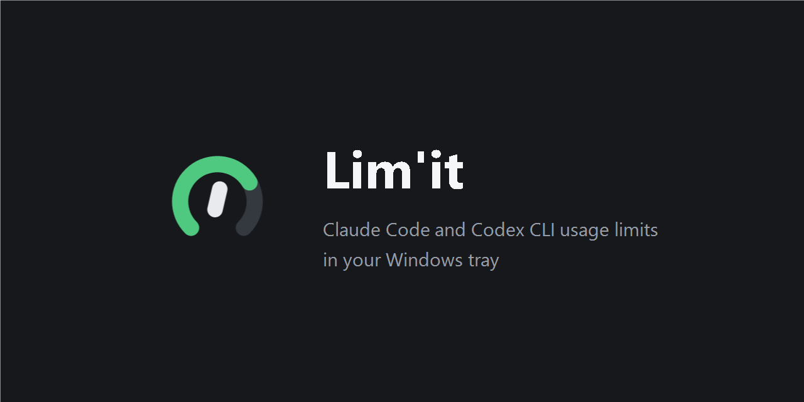
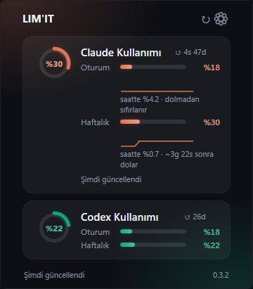

<div align="center">
  
</div>

<p align="center">
  <a href="https://github.com/morp1e/limit-tray/actions/workflows/ci.yml"></a>
  <a href="https://github.com/morp1e/limit-tray/releases/latest"></a>
  <a href="LICENSE"></a>
</p>

<p align="center">
  <a href="#download">Download</a> ·
  <a href="#why-this-exists">Why this exists</a> ·
  <a href="#how-it-works">How it works</a> ·
  <a href="#security-and-privacy">Security</a> ·
  <a href="#build-from-source">Build from source</a>
</p>

Both agents track a 5-hour and a 7-day window, but each hides that number inside its own
interactive session: `/usage` in Claude Code, `/status` in Codex. Lim'it puts both in one
place, so "how much do I have left?" does not cost you a session.



## Download

**[Download the latest release](https://github.com/morp1e/limit-tray/releases/latest)**.
One file, 64-bit Windows. Nothing to install: it carries its own .NET runtime, which is
also why it is around 70 MB.

Run it and it appears in the tray. Left-click for the panel, right-click for the menu
(**Start with Windows**, **Exit**). Startup is off until you turn it on.

You need Windows and an account already logged into whichever agent you want to track.
Lim'it reads what Claude Code and Codex have already authenticated. It never asks you to
log in again, and it has no settings file to fill in.

> **Windows will warn you the first time.** The executable is not code-signed, so
> SmartScreen shows "Windows protected your PC". Choose *More info* → *Run anyway*. Every
> release ships a `.sha256` file next to the binary if you would rather verify it first:
>
> ```powershell
> Get-FileHash .\limit-tray-v0.2.0-win-x64.exe -Algorithm SHA256
> ```
>
> The binary is built by [GitHub Actions from the tagged commit](.github/workflows/release.yml),
> not uploaded from a developer's machine.

The interface follows your Windows language, Turkish or English. Pass `--lang en` or
`--lang tr` to override it.

## Why this exists

I use both agents daily, and how much I can get done in a day now depends on those two
numbers. Checking them meant opening two sessions. So I built this for myself and put it
here in case it is useful to someone else.

There are already good tools in this space, several of them more mature, cross-platform, or
supporting more providers. If Lim'it does not fit you, try
[token-monitor](https://github.com/Javis603/token-monitor),
[Usage4Claude](https://github.com/f-is-h/Usage4Claude),
[brink](https://github.com/semihtalii/brink), or
[claude-codex-usage-dashboard](https://github.com/frankchiu-dev/claude-codex-usage-dashboard).

Beyond the two numbers, it answers the question you actually have when you look at
them: **how fast am I burning through this, and will it last?** From its own observations
it fits a consumption rate and projects when the window fills. When the window resets
before that can happen, it says so instead of showing a countdown to an event that will
never arrive.

The one thing Lim'it is deliberate about: **an error never looks like `0%`.** If the token is
missing, the endpoint rate-limits, or an upstream API changes shape, the panel says so in
words. `0%` only ever means a real, measured zero. Getting that wrong is the one failure that
would make a quota display worse than useless.

## How it works

The two providers expose their quota in completely different ways, so Lim'it reads them
differently.

**Claude.** Polls `GET https://api.anthropic.com/api/oauth/usage` every 120 seconds, sending
the OAuth token from `~/.claude/.credentials.json` and the header
`anthropic-beta: oauth-2025-04-20`. This is not a model call and does not consume your quota.

That endpoint is a shared resource: Claude Code itself calls it, so Lim'it is never the only
client and will sometimes get HTTP 429 no matter how politely it asks. When that happens it
backs off exponentially (2, 4, 8 … capped at 15 minutes) and keeps showing the last known
numbers, marked with their real age, instead of blanking the panel. A 429 here means the
usage *lookup* was throttled. It says nothing about your actual quota, and the UI wording is
careful about that distinction.

**Codex.** Speaks JSON-RPC to `codex app-server` over stdio, calling
`account/rateLimits/read` and listening for `account/rateLimits/updated` notifications. It
also re-reads on a timer, because app-server only pushes when the quota actually changes and
the data would otherwise look stale while being perfectly current. If app-server cannot be
started, Lim'it falls back to the last `rate_limits` block written into
`~/.codex/sessions/**/rollout-*.jsonl`, and clearly marks that data as stale.

**History.** Every fresh reading is kept in memory and mirrored to
`%LOCALAPPDATA%\limit-tray\history.json`. It buys three things:

- **A cold start during an outage is not blank.** The last known values are shown
  immediately, marked stale, carrying the age they actually have rather than pretending
  to be current.
- **A burn rate.** A least-squares fit over the retained samples gives percent-per-hour,
  and from it a projection of when the window fills. It appears only when the history can
  support it: at least three samples spanning at least ten minutes, on a window that is
  actually moving. Below that the line is simply absent, because a projection from two
  points an hour apart is a guess wearing a number's clothes.
- **A trend line.** The small sparkline under each bar plots the retained samples against
  real time, so a pause in usage looks like a pause.

A drop in the percentage means the window rolled over, so the series is dropped rather
than fitted across the reset. The file holds percentages, window lengths and timestamps
and nothing else; if it is missing or corrupt the app behaves exactly as it would on a
first run.

**Notifications.** Crossing 85% raises one balloon per window per fill. Staying above it
is silent, and falling back below it arms the next crossing. A tool that warns every two
minutes gets muted, and a muted warning is worth nothing.

All logic lives in `LimitTray.Core`, which has no WPF dependency and is covered by tests.
`LimitTray.App` only draws.

## Security and privacy

This app reads your Claude credentials file. You should want to know exactly what it does
with them, so:

- It reads `~/.claude/.credentials.json` for the OAuth access token, freshly on each request
  (Claude Code may have rotated it).
- The token is sent **only** to `api.anthropic.com`, in the `Authorization` header.
- The token is never written to disk, never logged, never shown in the UI or tooltip, and
  never included in an error message. Error text carries only a status code or an exception
  type name. There is a test asserting the token cannot leak into error details.
- Lim'it has no telemetry and no analytics, and makes no network request other than the usage
  endpoint above.
- The one file it writes is `%LOCALAPPDATA%\limit-tray\history.json`: percentages, window
  lengths and timestamps. No token, no account identifier, no request or response body, and
  no error text. Error detail can carry an exception message, so it is deliberately never
  persisted. Deleting the file loses the trend and nothing else.

The code is short and the relevant file is
[`ClaudeCredentialReader.cs`](src/LimitTray.Core/Claude/ClaudeCredentialReader.cs).
Please read it rather than take my word for it.

## Stability warning

Neither data source is a documented, supported API.

- The `anthropic-beta: oauth-2025-04-20` header is undocumented and versioned by date.
  Anthropic can change or remove it without notice.
- `codex app-server` is marked experimental by OpenAI and its method names may change.

If either breaks, Lim'it shows "API changed" rather than a wrong number, but it stops being
useful until the code is updated. Do not build anything important on top of it.

## Build from source

You need the [.NET 9 SDK](https://dotnet.microsoft.com/download/dotnet/9.0).

```
dotnet run --project src/LimitTray.App
dotnet run --project src/LimitTray.App -- --lang en
dotnet test
```

To produce the same single file the release ships:

```
dotnet publish src/LimitTray.App -c Release -r win-x64 --self-contained true ^
  -p:PublishSingleFile=true -p:EnableCompressionInSingleFile=true ^
  -p:IncludeNativeLibrariesForSelfExtract=true -p:DebugType=none -o publish/win-x64
```

`IncludeNativeLibrariesForSelfExtract` is the flag that matters: without it WPF's native
DLLs stay beside the executable and the "single file" is six files.

Releases are cut by pushing a tag (`git tag v0.3.0 && git push origin v0.3.0`), which runs
[the release workflow](.github/workflows/release.yml): tests, publish, checksum, upload.

### Artwork

`assets/limit.ico`, `assets/banner.png` and `assets/mark.png` are generated and committed:

```
dotnet run --project tools/IconGen -- icon assets/limit.ico
dotnet run --project tools/IconGen -- banner assets/banner.png
```

The generator draws the mark from scratch at each of the nine icon sizes rather than
downscaling one bitmap, and drops the apostrophe below 24 pixels where it would only muddy
the ring. It sits outside `LimitTray.sln` so it never becomes part of the shipped build.

## How this was built

Both rounds of this project were written by AI agents against a spec and a plan I wrote and
reviewed, and nothing was committed on an agent's word that it worked. Every task's build,
tests and observed behaviour were checked first.

The first round (the collectors, the panel, the health model) was written by OpenAI's Codex,
task by task. The second round (usage history, burn-rate projection, notifications, the icon)
was written by Claude. The spec and plan are in [`docs/`](docs/) if you want to see the actual
process, including the defects that came out of it.

Two of those are worth repeating, because between them they are the whole argument for
looking at the running application rather than trusting a green suite.

With 67 tests passing, the Codex side displayed nothing at all. `Encoding.UTF8` in .NET emits
a BOM, so the first JSON-RPC write put `EF BB BF` in front of the message; app-server failed
to deserialize it, wrote the error to a stderr nobody was reading, and answered nothing. No
unit test could catch that, because a fake process has no encoding. There is now a regression test
asserting the encoding emits no preamble.

The second is the mirror image. A percentage appeared to have vanished from the panel, and an
hour went into hunting it. The panel had been correct the entire time: the screenshot tool
had not declared DPI awareness, so on a 150% display it measured a 480×930 window as 320×620
and cropped the right third away. Looking at the running app is necessary, but the instrument
you look with is part of the experiment.

`AGENTS.md` in this repo is instruction context for AI coding agents working on it.

## License

MIT. See [LICENSE](LICENSE).
