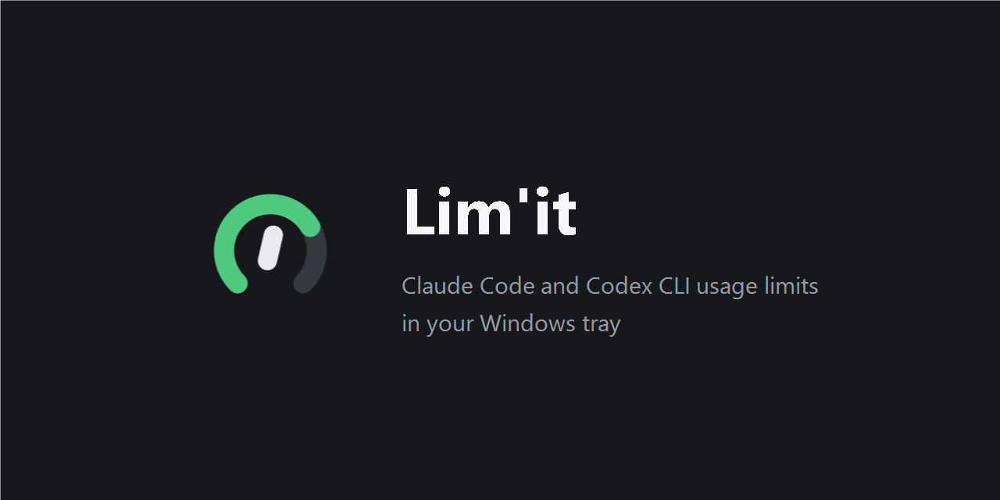
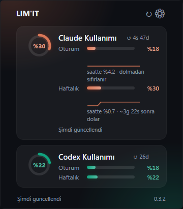
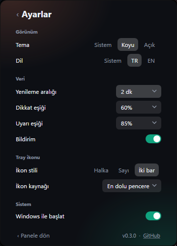

<div align="center">
  
</div>

<p align="center">
  <a href="https://github.com/morp1e/limit-tray/actions/workflows/ci.yml"></a>
  <a href="https://github.com/morp1e/limit-tray/releases/latest"></a>
  <a href="LICENSE"></a>
</p>

<p align="center">
  <a href="#download">Download</a> ·
  <a href="#why-this-exists">Why this exists</a> ·
  <a href="#footprint">Footprint</a> ·
  <a href="#how-it-works">How it works</a> ·
  <a href="#security-and-privacy">Security</a> ·
  <a href="#build-from-source">Build from source</a>
</p>

Both agents track a 5-hour and a 7-day window, but each hides that number inside its own
interactive session: `/usage` in Claude Code, `/status` in Codex. Lim'it puts both in one
place, so "how much do I have left?" does not cost you a session.

<p align="center">
  
  
</p>

## Download

**[Download the latest release](https://github.com/morp1e/limit-tray/releases/latest)**.
One 6 MB file for 64-bit Windows 10 or 11. Nothing to install: it is compiled ahead of time
to native code, so there is no .NET runtime to download.

Run it and it appears in the tray. Left-click for the panel, right-click for the menu
(**Start with Windows**, **Exit**). Startup is off until you turn it on.

You need Windows and an account already logged into whichever agent you want to track.
Lim'it reads what Claude Code and Codex have already authenticated. It never asks you to
log in again, and it has no settings file to fill in.

> **Windows will warn you the first time.** The executable is not code-signed, so
> SmartScreen shows "Windows protected your PC". Choose *More info* → *Run anyway*. Every
> release ships a `.sha256` file next to the binary if you would rather verify it first:
>
> ```powershell
> Get-FileHash .\limit-tray-v0.4.0-win-x64.exe -Algorithm SHA256
> ```
>
> The binary is built by [GitHub Actions from the tagged commit](.github/workflows/release.yml),
> not uploaded from a developer's machine.

The interface follows your Windows language, Turkish or English. Pass `--lang en` or
`--lang tr` to override it.

## Why this exists

I use both agents daily, and how much I can get done in a day now depends on those two
numbers. Checking them meant opening two sessions. So I built this for myself and put it
here in case it is useful to someone else.

There are already good tools in this space, several of them more mature, cross-platform, or
supporting more providers. If Lim'it does not fit you, try
[token-monitor](https://github.com/Javis603/token-monitor),
[Usage4Claude](https://github.com/f-is-h/Usage4Claude),
[brink](https://github.com/semihtalii/brink), or
[claude-codex-usage-dashboard](https://github.com/frankchiu-dev/claude-codex-usage-dashboard).

Beyond the two numbers, it answers the question you actually have when you look at
them: **how fast am I burning through this, and will it last?** From its own observations
it fits a consumption rate and projects when the window fills. When the window resets
before that can happen, it says so instead of showing a countdown to an event that will
never arrive.

**Colour means state, and only state.** Each provider's bars, ring and number wear its
brand colour while things are fine. At the caution threshold they turn amber, at the
warning threshold red, and data that has gone stale turns grey. So a glance at the panel,
or at the tray icon, tells you which provider is the one to worry about before you read a
single number. The thresholds, the refresh interval, the tray icon style and the theme are
all yours to change from the gear in the panel, and every change applies the moment you
make it.

Click a provider's card to expand it: the trend line, the burn rate and the age of the
reading appear. Hover a card and a small terminal glyph offers to open that agent's CLI in
a new window. The refresh arrow asks both providers for a reading now, at most once every
five seconds, because the Claude endpoint is shared with Claude Code itself.

The one thing Lim'it is deliberate about: **an error never looks like `0%`.** If the token is
missing, the endpoint rate-limits, or an upstream API changes shape, the panel says so in
words. `0%` only ever means a real, measured zero. Getting that wrong is the one failure that
would make a quota display worse than useless.

## Footprint

A tray icon should cost next to nothing, and up to v0.3 this one did not. The WPF build
held 180 MB of private memory at rest on my machine (Intel Iris Xe, two monitors, where
WPF's hardware rendering path is known to be expensive) and kept `codex app-server` running
beside it for another 21 MB. v0.4 is a rewrite of the interface in C# compiled to native
code with plain Win32 and software Direct2D, and it looks the same.

| | v0.3.4 (WPF) | v0.4.0 (native) |
|---|---|---|
| Download | 74 MB | 6 MB |
| Private memory at rest, real providers | 180 MB, plus 21 MB for `codex app-server` | 11.5 MB, no child process |
| Private memory at rest, fixture data | not measured | 6.4 MB |
| After using the panel | grew to 255 MB in use and stayed there | 8.0 MB after open, expand, settings, close |
| CPU at rest | ~0.05% | 0 ms per minute outside scheduled reads |

Measured with Private Bytes, which is what the process has actually committed; Task
Manager's "Memory" column shows the working set, which drops when Windows trims pages and
says little about cost. The v0.4 numbers come from
[`tools/Footprint/Measure-Footprint.ps1`](tools/Footprint/README.md), which runs a build
against fixture data and fails if it goes over 20 MB at rest or does not come back within
3 MB of that after using the panel.

What makes the difference: the panel window, its drawing surfaces and the Direct2D and
DirectWrite objects exist only while the panel is open. The tray icon is redrawn only when
what it shows changes. And Codex is no longer a process that lives as long as Lim'it does
(see below).

## How it works

The two providers expose their quota in completely different ways, so Lim'it reads them
differently.

**Claude.** Polls `GET https://api.anthropic.com/api/oauth/usage` every 120 seconds, sending
the OAuth token from `~/.claude/.credentials.json` and the header
`anthropic-beta: oauth-2025-04-20`. This is not a model call and does not consume your quota.

That endpoint is a shared resource: Claude Code itself calls it, so Lim'it is never the only
client and will sometimes get HTTP 429 no matter how politely it asks. When that happens it
backs off exponentially (2, 4, 8 … capped at 15 minutes) and keeps showing the last known
numbers, marked with their real age, instead of blanking the panel. A 429 here means the
usage *lookup* was throttled. It says nothing about your actual quota, and the UI wording is
careful about that distinction.

**Codex.** Two sources, neither of which keeps a process alive:

- Every 30 seconds Lim'it checks the size of the newest Codex session files in
  `~/.codex/sessions`. When one has grown, it reads the last 64 KB and takes the most
  recent `rate_limits` block that Codex CLI wrote there from its own server responses. So
  while you use Codex on this machine the number follows within half a minute. It never
  reads a whole file (they reach tens of megabytes) and change is judged by the file's real
  length, because Windows kept a file's modified time frozen while Codex was writing it.
- Every 10 minutes, at each known window reset plus 30 seconds, and when you open the panel
  with a Codex value older than two minutes, it starts `codex app-server`, calls
  `account/rateLimits/read`, and ends the process. A read takes a few seconds; usage on
  another device shows up this way.

The newer of the two readings wins. If a window's reset time passes before a new reading
arrives, the old percentage is shown as stale with its age rather than guessed down to 0%.
If app-server fails three times in a row, the card says so and the session files keep it
current.

**History.** Every fresh reading is kept in memory and mirrored to
`%LOCALAPPDATA%\limit-tray\history.json`. It buys three things:

- **A cold start during an outage is not blank.** The last known values are shown
  immediately, marked stale, carrying the age they actually have rather than pretending
  to be current.
- **A burn rate.** A least-squares fit over the retained samples gives percent-per-hour,
  and from it a projection of when the window fills. It appears only when the history can
  support it: at least three samples spanning at least ten minutes, on a window that is
  actually moving. Below that the line is simply absent, because a projection from two
  points an hour apart is a guess wearing a number's clothes.
- **A trend line.** The small sparkline under each bar plots the retained samples against
  real time, so a pause in usage looks like a pause.

A drop in the percentage means the window rolled over, so the series is dropped rather
than fitted across the reset. The file holds provider and window names, percentages,
window lengths and timestamps, including reset times. It holds no token, account ID,
response body or error detail. If it is missing or corrupt the app behaves exactly as it
would on a first run.

**Settings.** Everything you can change lives on the second page of the panel and in
`%LOCALAPPDATA%\limit-tray\settings.json`: theme (system, dark, light), language, the
refresh interval (60, 120 or 300 seconds), the two colour thresholds,
notifications, the tray icon style (a ring, a number or two bars, one per provider) and
which window drives it, and start with Windows. The file holds setting values and nothing
else; a missing or corrupt file means defaults, and a file that cannot be written is
reported on the settings page rather than by a crash.

**Notifications.** Crossing the warning threshold raises one balloon per window per fill. Staying above it
is silent, and falling back below it arms the next crossing. A tool that warns every two
minutes gets muted, and a muted warning is worth nothing.

All logic lives in `LimitTray.Core`, which knows nothing about windows or drawing and is
covered by tests. `LimitTray.Native` hosts the tray icon and draws the panel.

## Security and privacy

This app reads your Claude credentials file. You should want to know exactly what it does
with them, so:

- It reads `~/.claude/.credentials.json` for the OAuth access token, freshly on each request
  (Claude Code may have rotated it).
- The token is sent **only** to `api.anthropic.com`, in the `Authorization` header.
- The token is never written to disk, never logged, never shown in the UI or tooltip, and
  never included in an error message. Error text carries only a status code or an exception
  type name. There is a test asserting the token cannot leak into error details.
- Lim'it has no telemetry and no analytics, and makes no network request other than the usage
  endpoint above. The short-lived `codex app-server` it starts talks to OpenAI with Codex's
  own login, exactly as Codex CLI does.
- It reads the last 64 KB of your newest Codex session files and parses only the
  `rate_limits` block. Those files contain your Codex conversations; nothing else in them is
  parsed, kept in memory beyond the read, written anywhere or sent anywhere.
- It writes two files under `%LOCALAPPDATA%\limit-tray\`. `history.json` holds provider and
  window names, percentages, window lengths and timestamps; `settings.json` holds your
  settings. No token, account identifier, request or response body, or error text is stored
  in either. Error detail can carry an exception message, so it is deliberately never
  persisted. Deleting the files loses the trend and your preferences, and nothing else.
- If you enable **Start with Windows**, it writes a value under your per-user Windows Run
  registry key. Disabling the option removes that value. Startup is off by default.

The code is short and the relevant file is
[`ClaudeCredentialReader.cs`](src/LimitTray.Core/Claude/ClaudeCredentialReader.cs).
Please read it rather than take my word for it.

## Stability warning

Neither data source is a documented, supported API.

- The `anthropic-beta: oauth-2025-04-20` header is undocumented and versioned by date.
  Anthropic can change or remove it without notice.
- `codex app-server` is marked experimental by OpenAI and its method names may change.

If either breaks, Lim'it shows "API changed" rather than a wrong number, but it stops being
useful until the code is updated. Do not build anything important on top of it.

## Build from source

You need the [.NET 10 SDK](https://dotnet.microsoft.com/download/dotnet/10.0). To publish
the native executable you also need Visual Studio's **Desktop development with C++**
workload, which provides the linker NativeAOT uses.

```
dotnet run --project src/LimitTray.Native
dotnet run --project src/LimitTray.Native -- --lang en
dotnet test
```

To produce the executable the release ships:

```
dotnet publish src/LimitTray.Native -c Release -r win-x64 -o publish/win-x64
```

If the publish fails with `'vswhere.exe' is not recognized` followed by a linker exit code,
put the Visual Studio Installer folder on `PATH` for that shell
(`$env:PATH += ";${env:ProgramFiles(x86)}\Microsoft Visual Studio\Installer"`). The C++
environment script looks for `vswhere.exe` by name and its error ends up inside the linker
command.

To see the panel without a tray or live data, render it from a fixture:
`LimitTray.exe --render panel.png --fixture tools/Footprint/fixtures/normal.json`
([more](tools/Footprint/README.md)).

Releases are cut by pushing a tag (`git tag v0.3.0 && git push origin v0.3.0`), which runs
[the release workflow](.github/workflows/release.yml): tests, publish, checksum, upload.

### Artwork

`assets/limit.ico`, `assets/banner.png` and `assets/mark.png` are generated and committed:

```
dotnet run --project tools/IconGen -- icon assets/limit.ico
dotnet run --project tools/IconGen -- banner assets/banner.png
```

The generator draws the mark from scratch at each of the nine icon sizes rather than
downscaling one bitmap, and drops the apostrophe below 24 pixels where it would only muddy
the ring. It sits outside `LimitTray.sln` so it never becomes part of the shipped build.

## How this was built

Both rounds of this project were written by AI agents against a spec and a plan I wrote and
reviewed, and nothing was committed on an agent's word that it worked. Every task's build,
tests and observed behaviour were checked first.

The first round (the collectors, the panel, the health model) was written by OpenAI's Codex,
task by task. The second round (usage history, burn-rate projection, notifications, the icon)
was written by Claude. The third round, v0.3, was split: Claude wrote the spec and plan,
Codex wrote the settings model, colour rule, tray icon model and collector changes in
`LimitTray.Core` and the first cut of the WPF pages, and Claude did the visual work
(the mockup-matched look, the settings page polish) and every on-screen check.
The spec and plan are in [`docs/`](docs/) if you want to see the actual process, including
the defects that came out of it.

v0.4, the native rewrite, was split the same way. Codex wrote the data-path changes in
`LimitTray.Core` and the Win32 host, each in its own git worktree; Claude wrote the spec,
the plan and the whole drawing layer, and reviewed and ran everything before it was
merged. Two of Codex's lanes came back with real defects that their own tests did not
catch: the host never loaded `history.json`, and a tray-icon call that throws whenever
Explorer restarts. The drawing layer was checked against the v0.3 screenshots pixel by
pixel through the render command; the panel and settings pages match them in height and in
every edge, and three of the mismatches found on the way were WPF layout rules nobody had
written down.

v0.3 added one more defect to that list. With 217 tests green the app crashed at first
layout: a `Run` bound to a read-only view-model property defaults to a two-way binding,
which WPF refuses at runtime. No test can see a XAML binding mode. The app was run before
anything was committed, so the crash cost minutes rather than a release.

Two of those are worth repeating, because between them they are the whole argument for
looking at the running application rather than trusting a green suite.

With 67 tests passing, the Codex side displayed nothing at all. `Encoding.UTF8` in .NET emits
a BOM, so the first JSON-RPC write put `EF BB BF` in front of the message; app-server failed
to deserialize it, wrote the error to a stderr nobody was reading, and answered nothing. No
unit test could catch that, because a fake process has no encoding. There is now a regression test
asserting the encoding emits no preamble.

The second is the mirror image. A percentage appeared to have vanished from the panel, and an
hour went into hunting it. The panel had been correct the entire time: the screenshot tool
had not declared DPI awareness, so on a 150% display it measured a 480×930 window as 320×620
and cropped the right third away. Looking at the running app is necessary, but the instrument
you look with is part of the experiment.

`AGENTS.md` in this repo is instruction context for AI coding agents working on it.

## License

MIT. See [LICENSE](LICENSE).
